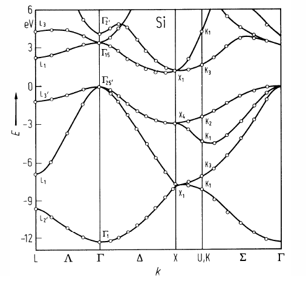
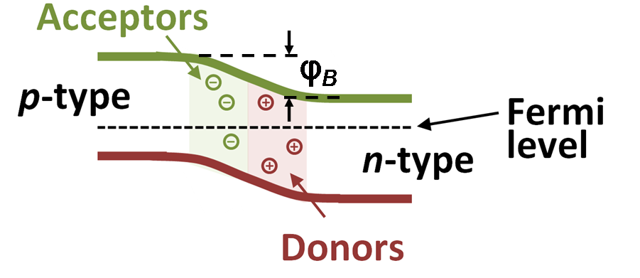

footer: Carsten Wulff 2024
slidenumbers:true
autoscale:true
theme: Plain Jane, 1
text:  Helvetica
header:  Helvetica
date: 2024-10-25

<!--pan_skip:-->

# A Refresher

---

<!--pan_doc:
<iframe width="560" height="315" src="https://www.youtube.com/embed/FbqfuE3tzF0?si=TiVId-ovoHPeDURM" title="YouTube video player" frameborder="0" allow="accelerometer; autoplay; clipboard-write; encrypted-media; gyroscope; picture-in-picture; web-share" allowfullscreen></iframe>

-->

<!--pan_title: A Refresher-->

# There are standard units of measurement

All known physical quantities are derived from 7 base units ([SI units](https://en.wikipedia.org/wiki/International_System_of_Units))

- second (s) : time 
- meter (m) : space 
- kg (kilogram) : weight
- ampere (A) : current 
- kelvin (K) : temperature 
- candela (cd) : luminous intensity

All other units (for example volts), are derived from the base units.

<!--pan_doc: 

I don't go around remembering all of them, they are easily available online. 
When you forget the equation for charge (Q), voltage (V) and capacitance (C), 
look at the units below, and you can see it's $Q=CV$ [^1]

-->

<!---->


<!--pan_doc: 

<sub>Figure 1: Si base units, from [https://www.nist.gov/pml/owm/metric-si/si-units](https://www.nist.gov/pml/owm/metric-si/si-units)</sub>

-->


---

#  Electrons

Electrons are fundamental, they cannot (as far as we know), be divided
into smaller parts. Explained further in the [standard model of particle physics](https://en.wikipedia.org/wiki/Standard_Model)


<!--pan_doc:

<sub>Figure 2: Standard model of particle physics, Wikipedia</sub>

Electrons have a negative charge of $q \approx 1.602 \times 10^{-19}$. The proton a positive charge. The two charges balance exactly! If you have a trillion electrons and a trillion protons inside a volume, the net external charge will be $0$ (assuming we measure from some distance away). I find this fact absolutely incredible. There must be a fundamental connection between the charge of the proton and electron. It's insane that the charges balance out so exactly.

All electrons are the same, although the quantum state can be different.

-->

An electron cannot occupy the same quantum state as another. This rule that applies to all Fermions (particles with spin of 1/2)

The quantum state of an electron is fully described by it's spin, momentum (p) and position in space (r).

---

#  Probability

The probability of finding an electron in a state as a function of space and time is 

$$ P = |\psi(r,t)|^2 $$

, where $\psi$ is named the probability amplitude, and is a complex function of space and time. In some special cases, it's

$$ \psi(r,t) = A e^{i( kr - \omega t)}$$

<!--pan_doc: 

, where A is complex number, k is the wave number, r is the position vector from
some origin, $\omega$ is the frequency and $t$ is time.


The energy is $E = \hbar \omega$ , where $\hbar = h/2\pi$ and $h$ is 
[Planck Constant](https://en.wikipedia.org/wiki/Planck_constant) and the momentum is $p = \hbar k$

The probability amplitude is also called the wave function. Type of wave function depends on the scenario, and does not have to take on the solution above. The possible wave functions are those equations that fits with the time evolution of quantum states given by the Schrodinger equation. 

-->

---

#  Uncertainty principle

We cannot, with ultimate precision, determine both the position and the momentum of a particle, the precision is 

$$\sigma_x \sigma_p \ge \frac{\hbar}{2}$$

From the [uncertainty (Unschärfe) principle](https://en.wikipedia.org/wiki/Uncertainty_principle) we can actually [estimate the size of the atom](https://wulffern.github.io/aic2023/atom)

---

#  States as a function of time and space

The time-evolution of the probability amplitude is 

$$ i\hbar \frac{d}{dt} \psi(r,t) = H \psi(r,t)$$

, where H is named the Hamiltonian matrix, or the energy matrix or (if I understand correctly) the amplitude matrix of the probability amplitude to change from one state to another. 

<!--pan_doc:

For example, if we have a system with two states, a simplified version of two electrons shared between two atoms, as in $H_2$, or hydrogen gas, or co-valent bonds, then the Hamiltonian is a 2 x 2 matrix. And the $\psi$ is a vector of $[\psi_1,\psi_2]$

Computing the solution to the [Schrodinger Equation](https://en.wikipedia.org/wiki/Schrödinger_equation) can be tricky, because you must know the number of relevant states to know the vector size of $\psi$ and the matrix size of $H$. In addition, the $H$ can be a function of time and space (I think).

Compared to the equations of electric fields, however, Schrodinger is easy, it's a set of linear differential equations.

-->

---

#  Allowed energy levels in atoms

Solutions to Schrodinger result in quantized energy levels for an electron bound to an atom.

<!--pan_doc:

Take hydrogen, the electron bound to the proton can only exists in quantized
energy levels. The lowest energy state can have two electrons, one with spin up,
and one with spin down.


From Schrodinger you can compute the energy levels, which most of us did at
some-point, although now, I can't remember how it was done. That's not important.
The important is to internalize that the energy levels in bound electrons are
discrete.


Electrons can transition from one energy level to another by external influence,
i.e temperature, light, or other.

-->

The probability of a state transition (change in energy) can be determined from the probability amplitude and Schrodinger.

---

#  Allowed energy levels in solids

<!--pan_doc: 

If I have two silicon atoms spaced far apart, then the electrons can have the
same spin and same momentum around their respective nuclei. As I bring the atoms
closer, however, the probability amplitudes start to interact (or the dimensions
of the Hamiltonian matrix grow), and there can be state transitions between the
two electrons.


The allowed energy levels will split. If I only had two states interacting, the Hamiltonian could be

-->

$$ H = 
\begin{bmatrix}
A & 0 \\
0 & -A
\end{bmatrix}
$$

and the new energy levels could be 

$$ E_1 = E_0 + A$$

and 

$$ E_2 = E_0 - A$$


<!--pan_doc: 

In a silicon crystal we can have trillions of atoms, and those that are close, have states that interact. **That's why crystals stay solids**. All chemical bonds are states of electrons interacting! Some are strong (co-valent bonds), some are weaker (ionic bonds), but it's all quantum states interacting.

The discrete energy levels of the electron transition into bands of allowed energy states. 

-->

<!---->

<!--pan_doc:

<sub>Figure 3: [Electronic band structure, Wikipedia](https://en.wikipedia.org/wiki/Electronic_band_structure)</sub>

For a crystal, the allowed energy bands is captured in the [band structure](https://en.wikipedia.org/wiki/Electronic_band_structure)


-->


---

# Silicon Unit Cell

A [silicon](https://en.wikipedia.org/wiki/Silicon) crystal unit cell is a diamond faced cubic with 8 atoms in the corners spaced at 0.543 nm, 6 at the center of the
faces, and 4 atoms inside the unit cell at a nearest neighbor distance of 0.235 nm. 

<!---->

<!--pan_doc:
<sub>Figure 4: [Silicon, Wikipedia](https://en.wikipedia.org/wiki/Silicon)</sub>
-->

---

# Band structure 

The full band structure of a silicon unit cell is complicated, it's a [3 dimensional concept](http://lampx.tugraz.at/~hadley/ss1/semiconductors/silicon_bandstructure.php)

<!---->



<!--pan_doc: 
<sub>Figure 5: [Silicon Band Structure](http://lampx.tugraz.at/~hadley/ss1/semiconductors/silicon_bandstructure.php)</sub>
-->

---

# Valence band and Conduction band

For bulk silicon we simplify, and we think of two bands, the conduction band, and valence band

<!--pan_doc:

In the  conduction band ($E_C$) is the
lowest energy where electrons are free (not bound to atoms). The valence band
($E_V$) is the highest band where electrons are bound to silicon atoms.  

The difference between  $E_C$ and $E_V$ is a property of the material we've named the band gap. 

-->

$$ E_G = E_C - E_V$$

---

# Fermi level

<!--pan_doc: 

From Wikipedia's [Fermi level](https://en.wikipedia.org/wiki/Fermi_level)

-->

> In band structure theory, used in solid state physics to analyze the energy levels in a solid, the Fermi level can be considered to be a hypothetical energy level of an electron, such that at thermodynamic equilibrium this energy level would have a 50% probability of being occupied at any given time

<!--pan_doc: 

The Fermi level is closely linked to the [Fermi-Dirac
distribution](https://en.wikipedia.org/wiki/Fermi%E2%80%93Dirac_statistics)

-->

$$
f(E) = \frac{1}{e^{(E - E_F)/kT} + 1}
$$

<!--pan_doc: 

If the energy of the state is more than a few kT away from the Fermi-level, then

-->

$$
f(E) \approx e^{(E_F - E)/kT}
$$

<!--pan_doc:

The equation above is one of the reasons the structure $e^{E/kT}$ or $e^{qV/kT}$ shows up all over the place. You'll see it in the equations for current in a diode, $I_D = I_s (e^{q V_D/nkT} -1)$, the subthreshold conduction of a mosfet $I_D \propto e^{q V_{gs}/nkT}$ and even the [Arrhenius Equation](https://en.wikipedia.org/wiki/Arrhenius_equation) $k = A e^{-E_a/kT}$. 

It seems like any time you have something related to chemical reactions (state transitions of electrons, breaking bonds, forming bonds), or current in solids, there is a relation to the equation above. To me, that makes sense. 

The Fermi-Dirac function also explains why there are more free carriers, and reaction rates increase, at high temperature. The part of the equation that is $e^{-E/kT}$ will approach one at high temperatures.

-->

---

# Metals

In metals, the band splitting of the energy levels causes the valence band and conduction band to overlap. 

<!---->

<!--pan_doc:

<sub>Figure 6: Band splitting in materials. [Electronic Band Structure, Wikipedia](https://en.wikipedia.org/wiki/Electronic_band_structure)</sub>

Electrons can easily transition between bound state and free state. As such, electrons in metals are shared over large distances, and there are many electrons readily available to move under an applied field, or difference in electron density. That's why metals conduct well.

-->

---

# Insulators

In insulating materials the difference between the conduction band and the valence band is large. As a result, it takes a large energy to excite electrons to a state where they can freely move. 

That's why glass is transparent to optical frequencies. Visible light does not have sufficient energy to excite electrons from a bound state.

That's also why glass is opaque to ultra-violet, which has enough energy to excite electrons out of a bound state.

Based on these two pieces of information you could estimate the bandgap of glass.

<!--pan_doc: 

```python
from scipy import constants
#- We must use the "correct" units for planck's constant to get energy in eV
h = constants.physical_constants["Planck constant in eV/Hz"][0]
c = constants.physical_constants["speed of light in vacuum"][0]

lambda_optical = 450e-9
e_optical = h * c/lambda_optical

lambda_ultra = 380e-9
e_ultra = h * c/lambda_ultra

print("Bandgap of glass is above %.2f eV, maybe around %.2f eV " %(e_optical,e_ultra))
```
-->

---

# Semiconductors

In silicon the bandgap is lower than an insulator, approximately 

$$E_G = 1.12\text{ } eV$$

At room temperature, that allows a small number of electrons to be excited into the conduction band, leaving behind a "hole" in the valence band.

---


# Band diagrams

A [band diagram](https://en.wikipedia.org/wiki/Band_diagram) or energy level
diagrams shows the conduction band energy and valence band energy as a function
of distance in the material.

<!---->


<!--pan_doc:
<sub>Figure 7: [Band diagram of a PN junction, Wikipedia](https://en.wikipedia.org/wiki/Band_diagram)</sub>
-->

The horizontal axis is the distance in the material, the vertical axis is the energy.


---

# Density of electrons/holes 

<!--pan_doc:

There are two components needed to determine how many electrons are in the
conduction band. The density of available states, and the probability of an
electron to be in that quantum state. 

The probability is the Fermi-Dirac distribution. The density of available states
is a complicated calculation from the band-structure of silicon. 

For details see the Diodes chapter.

-->

$$ n_e = \int_{E_C}^{\infty} N(E)f(E) dE$$

<!--pan_doc:

The Fermi level is assumed to be independent of energy level, so we can write 

-->

$$ n_e = e^{E_F/kT}  \int_{E_C}^{\infty} N(E) e^{-E/kT}dE$$

<!--pan_doc: 

for the density of electrons in the conduction band.

-->

---

# Fields 

There are equations that relate electric field, magnetic field, charge density and current density to each-other. 

---

$$ \oint_{\partial \Omega} \mathbf{E} \cdot d\mathbf{S} = \frac{1}{\epsilon_0} \iiint_{V} \rho
\cdot dV$$  

,relates net electric flux to net enclosed electric charge

---

$$ \oint_{\partial \Omega} \mathbf{B} \cdot d\mathbf{S} = 0$$

,relates net magnetic flux to net enclosed magnetic charge

---

$$ \oint_{\partial \Sigma} \mathbf{E} \cdot d\mathbf{\ell} = - \frac{d}{dt}\iint_\Sigma \mathbf{B}
\cdot d\mathbf{S}$$

,relates induced electric field to changing magnetic flux

---

$$ \oint_{\partial \Sigma} \mathbf{B} \cdot d\mathbf{\ell} = \mu_0\left(
\iint_\Sigma \mathbf{J} \cdot d\mathbf{S} + \epsilon_0 \frac{d}{dt}\iint_\Sigma
\mathbf{E} \cdot d\mathbf{S} \right)$$

,relates induced magnetic field to changing electric flux and to current

---

These are the [Maxwell Equations](https://en.wikipedia.org/wiki/Maxwell%27s_equations), and are non-linear time dependent differential equations. 

Under the best of circumstances they are fantastically hard to solve! But it's how the real world works.

---

# Permittivity and Permeability


<!--pan_doc:

The permittivity of free space is defined as 

-->

[.column]

$$\epsilon_0 = \frac{1}{\mu_0 c^2}$$

<!--pan_doc:

, where $c$ is the [speed of light](https://en.wikipedia.org/wiki/Speed_of_light), and $\mu_0$ is the [vacuum permeability](https://en.wikipedia.org/wiki/Vacuum_permeability), which, in [SI units](https://en.wikipedia.org/wiki/International_System_of_Units), is now

-->

[.column]

$$\mu_0 = \frac{2 \alpha}{q^2}\frac{h}{c}$$ 


<!--pan_doc:

, where $\alpha$ is the [fine structure constant](https://en.wikipedia.org/wiki/Fine-structure_constant).

-->

---

# Quantum electrodynamics

<!--pan_doc:

The quantum electrodynamics (QED) is a full description of interactions between light and matter. The equations describe both quantum mechanical effects, electromagnetism and is in agreement with special relativity. 

The equations are rather complicated, but it's based on [Lagrangian](https://en.wikipedia.org/wiki/Lagrangian_(field_theory)) physics. Maxwell's equations actually fall out of the QED Lagrangian when one assumes local phase symmetry. 

-->

The QED Lagrangian is 

$$ \mathcal{L} = \bar{\psi}[i \hbar c \gamma^\mu\partial_\mu - mc^2]\psi - q[\bar{\psi} \gamma^\mu \psi] A_\mu - \frac{1}{16 \pi}F_{\mu\nu}F^{\mu\nu} $$

For more information, have a look at [Electromagnetism as a Gauge Theory](https://www.youtube.com/watch?v=Sj_GSBaUE1o)

---


# Voltage 

The electric field has units voltage per meter, so the electric field is the derivative of the voltage as a function of space.

$$ E = \frac{dV}{dx}$$

---

# Current 

<!--pan_doc:

Current has unit $A$ and charge $C$ has unit $As$, so the current is the number of charges passing through a volume per second. 

The current density $J$ has units $A/m^2$ and is often used, since we can multiply by the surface area of a conductor, if the current density is uniform. 

-->

$$ I  = \text{Area} \times J $$

---

# Drift current

Charge carriers (electrons, holes, ions) in an electric field will give rise to a drift current. 

We know from Newtons laws that force equals mass times acceleration 

$$ \vec{F} = m \vec{a}$$

---

If we assume a zero, or constant magnetic field, the force on a particle is

$$\vec{F} = q\vec{E}$$

The current density is then 

$$ \vec{J} = q\vec{E} \times n \times \mu $$

<!--pan_doc: 

where $n$ is the charge density, and $\mu$ is the mobility (how easily the
charges move) and has units $m^2/Vs$

-->

---

Assuming 

$$ E = V/m$$

, we could write 

$$ J = \frac{C}{m^3}\frac{V}{m}\frac{m^2}{Vs} = \frac{C}{s}m^{-2}$$

---

So multiplying by an area A with unit meters squared

$$ I = q n \mu A V$$

and we can see that the conductance 

$$G = q n \mu A$$

---

, and since 

$$G = 1/R$$

, where R is the resistance, we have

$$ I = G V \Rightarrow V = RI$$

Or [Ohms law](https://en.wikipedia.org/wiki/Ohm%27s_law)

---

# Diffusion current

A difference in charge density will give rise to a diffusion current. The current density is

$$ J = -q D_n \frac{d \rho}{dx}$$

<!--pan_doc:

,where $D_n$ is a diffusion constant, and $\rho$ is the charge density.

-->

---

# Why are there two currents?

<!--pan_doc:

I struggled with the concepts diffusion current and drift current for a long time.  Why are there two types of current? It was when I read [The Schrödinger Equation in a Classical Context: A Seminar on Superconductivity](https://www.feynmanlectures.caltech.edu/III_21.html) I realized that 
the two types of current come directly from the Schrodinger equation, there is one component related to the electric field (potential energy) and a component related to the momentum (kinetic energy). 

In the absence of an electric field electrons will still jump from state to state set 
by the probabilities of the Hamiltonian. If there are more electrons in an area, then it will seem
like there is an average movement of charges away from that area. That's how I think about drift and diffusion currents. We can kinda see it from the Schrödinger equation below. 

-->

$$-\frac{\hbar^2}{2 m} \frac{\partial^2}{\partial^2 x}\psi(x,t) +
V(x)\psi(x,t) = i\hbar\frac{\partial}{\partial t} \psi(x,t) $$

---

# Currents in a semiconductor

Both electrons, and holes will contribute to current.

Electrons move in the conduction band, and holes move in the valence band. 

<!--pan_doc: 

Both holes and electrons can only move if there are available quantum states. 

For example, if the valence band is completely filled (all states filled), then
there can be no current. 

To compute the total current in a semiconductor one must compute 

-->

$$ I  = I_{n_{drift}} +I_{n_{diffusion}} + I_{p_{drift}}  + I_{p_{diffusion}}$$

<!--pan_doc:

where $n$ denotes electrons, and $p$ denote holes.

-->

---

# Resistors 

<!--pan_doc:
We can make resistors with many materials. The behavior of the charge carrier may be different between materials.
-->

In metal the dominant carrier depends on the metal, but it's usually electrons. As such, one can often ignore the hole current.

In a semiconductor the dominant carrier depends on the Fermi level in relation to the conduction band and valence band. 

If the Fermi level is close to the valence band the dominant carrier will be holes. If the Fermi level is close to the conduction band, the dominant carrier will be electrons.

That's why we often talk about "majority carriers" and "minority carriers", both are important in semiconductors.

---

# Capacitors 

A capacitor resists a change in voltage

$$ I = C \frac{dV}{dt}$$

and store energy in an electric field between two conductors with an insulator between.

---

# Inductors

An inductor resist a change in current

$$ V = L \frac{dI}{dt}$$

and store energy in the magnetic fields in a loop of a conductor. 

---

<!--pan_doc: 

[^1]: Although you do have to keep your symbols straight. We use "C" for Capacitance, but C can also mean Columbs. Context matters.

-->


