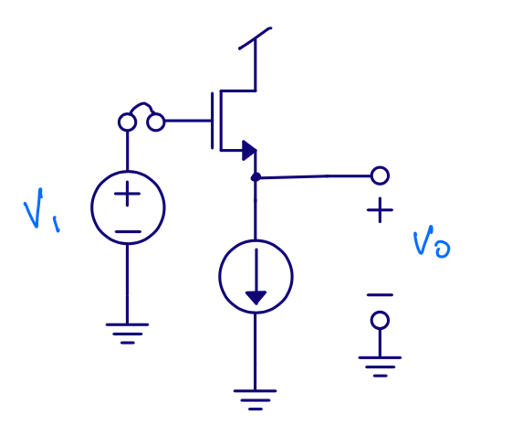
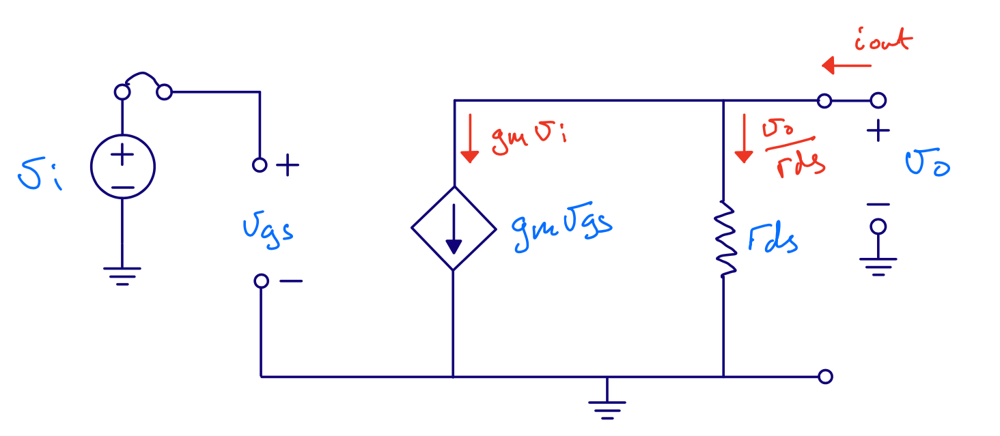

footer: Carsten Wulff 2025
slidenumbers:true
autoscale:true
theme: Plain Jane, 1
text:  Helvetica
header:  Helvetica
date: 2025-01-08

<!--pan_skip: -->

<!--pan_title: Circuits -->

# Integrated Circuits

<!--pan_doc: 

Most of the circuit design on integrated circuits uses MOSFET transistors. This section provides a short 
refresh of the most common circuits and their properties.

-->
---

<!--pan_skip: -->

---

#[fit] Current Mirrors

---

<!--pan_doc: 

MOSFETs need a current for the transistor to be biased in the correct operating region. The current must come from somewhere, we'll look at
bias generators later. Usually there is a central bias circuit that provides a single, good, reference current.

On an IC, however, there will be many circuits, and they all need a bias current (usually). As such, we need a circuit to copy a current. 

In the figure below you can see a selection of current mirros. They all do the same thing. Try to ensure that $i_i$ and $i_o$ are the same current. 

Which one we choose is usually determined by what we mean by $i_i = i_o$. Do we mean "within $\pm$ 10 %", or "within $\pm$ 2 %". 

-->

---

## Normal current mirror

<!--pan_doc: 

The normal current mirror consists of a diode connected transistor ($M_1$) and a common source transistor $M_2$. 

If we assume infinite output resistance of the MOSFETs, then the drain voltage does not affect the current. 

If the two transistors are the same size, threshold voltage, mobility, etc, and they have the same gate-source voltage, then the current in them must be the same. 

A current pushed into $M_1$ will cause the $V_{GS1}$ to rise, and at some point, find a stable point where the current pushed in is equal to the current in $M_1$

$M_2$ will see the same $V_{GS1} = V_{GS2}$ so the current will be the same, provided the voltage at $i_o$ is sufficient to pinch-off the channel of $M_2$, or 
the $V_{DS2} \approx 3 kT/q$ if the transitor is in weak-inversion.

-->

---

### Input resistance 

<!--pan_doc:

To see the small signal input resistance we can apply a test voltage to the diode connected resistor, as shown in the figure below.

-->

Observe the current 

$$ i_y = g_{ds}v_y + g_m v_y $$

While the input resistance

$$ r_{in}= \frac{v_y}{i_y} = \frac{1}{g_m + g_{ds}} $$

<!--pan_doc:

which, assuming $g_{ds} >> g_{m}$, reduces to 

$$ r_{in} \approx \frac{1}{g_m} $$.

Assume now I apply $1\text{ }\mu A$ current to the diode connected transistor, and the $g_{m} = 1\text{ }\mu S$. 

Would the voltage be $v_y = r_{in} i_y = \frac{1\text{ }\mu A}{1\text{ }\mu S} = 1\text{ }V$? NO! It's important to understand the difference between the small signal input resistance, and the large signal impedance. 

The large signal impedance is a highly non-linear function (we've seen before that the current in a MOSFET has both an exponential, and a square-law, and sometimes a linear with voltage), as such, there is no single function describing what the gate-source voltage will be. 

To see the DC voltage, apply a current in SPICE, and use a simulator to find the voltage. 

-->

---

### Output resistance

---

### Current gain 

---

## Source degeneration

What is the operating region of M3 and M4?

What is the operating region of M1 and M2?

---

### Input resistance

M1 and M2 are in linear region, can be simplified to resistors

 $$r_{in} = \frac{1}{g_{m1}}+ R_s$$

---

## Output resistance

$$v_{gs} = -v_{s}$$, $$v_{s} = i_x R_s$$, $$r_{out} = \frac{v_x}{i_x}$$

$$i_x = g_{m2} v_{gs} + \frac{v_x - v_s}{r_{ds2}}$$

$$i_x = -i_x g_{m2} R_s + \frac{v_x - i_x R_s}{r_{ds2}}$$

$$v_x = i_x\left[ r_{ds2} + R_s(g_{m2} r_{ds2} + 1)\right]$$ 

Rearranging

$$ r_{out} =  r_{ds2}[1 + R_s(g_{m1} + g_{ds2})] \approx r_{ds2} [1 + g_{m1}R_s]$$ 

---

### Cascode output resistance

From source degeneration (ignoring bulk effect)

$$r_{out} =  r_{ds4}[1 + R_s(g_{m4} + g_{ds4})] $$

$$ R_S = r_{ds2} $$

$$
r_{out} =  r_{ds4}[1 + r_{ds2}(g_{m4} + g_{ds4})] 
$$

$$
r_{out} \approx  r_{ds2}(r_{ds4}g_{m4})
$$

---

### Active cascodes

$$
r_{out} \approx  r_{ds2}(A r_{ds4} g_{m4})
$$

---

#[fit] Amplifiers

---

#[fit] Source follower

---

Input resistance $$\approx \infty$$

Gain $$ A = \frac{v_o}{v_i}$$

Output resistance $$r_{out}$$

---

<!--pan_skip: -->

## Gain

$$ i_o = v_o (g_{ds} + g_{s}) - g_{m} v_i + v_o g_m $$

$$ i_o = 0 $$

$$ g_m v_i = v_o ( g_m + g_s + g_{ds} ) $$

$$ A = \frac{v_o}{v_i} = \frac{g_m}{g_m + g_{ds} + g_s} $$

**Gain is less than 1**

---

## Output resistance 

$$ i_o = v_o (g_{ds} + g_{s}) - g_{m} v_i + v_o g_m $$

$$v_i = 0$$

$$ i_o = v_o (g_{ds} + g_{s} + g_m) $$

$$ r_{out} = \frac{v_o}{i_o} = \frac{1}{g_m + g_{ds} + g_{s}} $$

$$ r_{out} \approx \frac{1}{g_m}$$

---

## Why use a source follower?

Assume 100 electrons

[.column]

$$ \Delta V  = Q/C  = -1.6 \times 10^{-19} \times 100 / (1\times 10^{-15}) = - 16\text{ mV} $$ 

[.column]

$$ \Delta V  = Q/C  = -1.6 \times 10^{-19} \times 100 / (1\times 10^{-12}) = - 16\text{ uV} $$ 

---

#[fit] Common gate

---

Input resistance 

Gain 

Output resistance  

---

## Input resistance

$$ i = g_m v + g_{ds} v $$

$$ r_{in} = \frac{1}{g_m + g_{ds}} \approx \frac{1}{g_m}$$

However, we've ignored load resistance. 

$$ r_{in}  \approx \frac{1}{g_m}\left(1 + \frac{R_L}{r_{ds}}\right) $$

<!--pan_skip: -->

---

## Output resistance

---

## Gain

$$ i_{o} = - g_m v_{i} + \frac{v_{o} - v_{i}}{r_{ds}} $$

$$ i_{o}  = 0 $$

$$ 0 = - g_m v_{i} r_{ds}  + v_{o} - v_{i}$$

$$ v_{i} (1 + g_m r_{ds}) = v_{o} $$

$$ \frac{v_o}{v_i} = 1 + g_m r_{ds} $$

<!--pan_skip: -->

---

We've ignored bulk effect ($$g_s$$), source resistance ($$R_S$$) and load resistance ($$R_L$$)

$$ A = \frac{(g_{m} + g_s + g_{ds})(R_L||r_{ds})}{1 + R_S\left(\frac{g_m + g_s +
g_{ds}}{1 + R_L/r_{ds}}\right)}$$

If $$R_L >> r_{ds} $$, $$R_S  = 0$$ and $$g_s = 0$$

$$ A = \frac{(g_{m} + g_{ds})r_{ds}}{1} = 1+ g_m r_{ds} $$ 

<!--pan_skip: -->

---

#[fit] Common source

---

$$r_{in} \approx \infty$$

$$r_{out}  = r_{ds}$$, it's same circuit as the output of a current mirror

Gain 

---

##  Gain

$$ i_{o} = g_m v_i + \frac{v_o}{r_{ds}} $$

$$ i_o = 0 $$

$$ -g_m v_i = \frac{v_o}{r_{ds}} $$

$$ \frac{v_o}{v_i} = - g_m r_{ds}$$

---

<!--pan_doc: 

## Why common source?

-->

---
# Differential pair

Input resistance $$r_{in} \approx \infty$$

Gain  $$ A  = g_m r_{ds} $$

Output resistance $$ r_{out} = r_{ds}$$

Best analyzed with T model of transistor (see CJM page 31)

---

## Diff pairs are cool

 Can choose between 

 $$ v_o = g_m r_{ds} v_i$$

 and 

 $$ v_o = -g_m r_{ds} v_i$$
 
 by flipping input (or output) connections

---

---

#[fit] Thanks!

---

