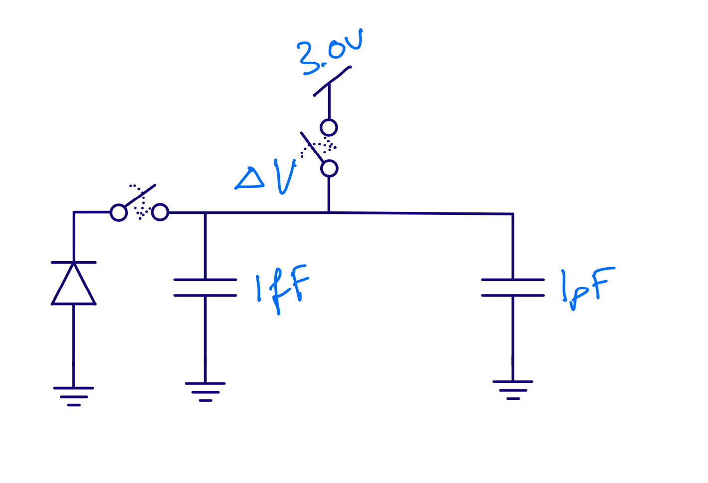
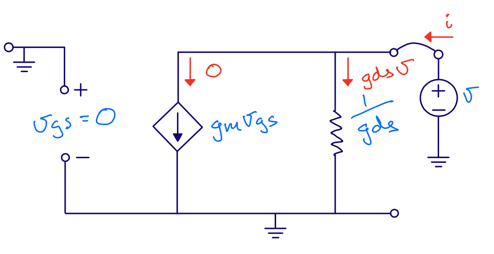

footer: Carsten Wulff 2021
slidenumbers:true
autoscale:true
theme: Plain Jane, 1
text:  Helvetica
header:  Helvetica
date: 2025-01-08

<!--pan_skip: -->

# Circuits

---

#[fit] Current Mirrors

---

---

- $$r_{in}$$
- $$r_{out}$$
- $$\frac{i_{o}}{i_{i}}$$
- Source degeneration
- Cascode

---
 $$r_{in}$$

---
 $$r_{out}$$

---
 $$\frac{i_{o}}{i_{i}}$$

---

## Source degeneration

What is the operating region of M3 and M4?

What is the operating region of M1 and M2?

---

M1 and M2 are in linear region, can be simplified to resistors

 $$r_{in} = \frac{1}{g_{m1}}+ R_s$$

---

$$v_{gs} = -v_{s}$$, $$v_{s} = i_x R_s$$, $$r_{out} = \frac{v_x}{i_x}$$

$$i_x = g_{m2} v_{gs} + \frac{v_x - v_s}{r_{ds2}}$$

$$i_x = -i_x g_{m2} R_s + \frac{v_x - i_x R_s}{r_{ds2}}$$

$$v_x = i_x\left[ r_{ds2} + R_s(g_{m2} r_{ds2} + 1)\right]$$ 

Rearranging

$$ r_{out} =  r_{ds2}[1 + R_s(g_{m1} + g_{ds2})] \approx r_{ds2} [1 + g_{m1}R_s]$$ 

---

# Cascode

From source degeneration (ignoring bulk effect)

$$r_{out} =  r_{ds4}[1 + R_s(g_{m4} + g_{ds4})] $$

$$ R_S = r_{ds2} $$

$$
r_{out} =  r_{ds4}[1 + r_{ds2}(g_{m4} + g_{ds4})] 
$$

$$
r_{out} \approx  r_{ds2}(r_{ds4}g_{m4})
$$

---

# One more thing ....

---

---

#[fit] Amplifiers

---

#[fit] Source follower

---

Input resistance $$\approx \infty$$

Gain $$ A = \frac{v_o}{v_i}$$

Output resistance $$r_{out}$$

---

<!--pan_skip: -->

---

## Gain

$$ i_o = v_o (g_{ds} + g_{s}) - g_{m} v_i + v_o g_m $$

$$ i_o = 0 $$

$$ g_m v_i = v_o ( g_m + g_s + g_{ds} ) $$

$$ A = \frac{v_o}{v_i} = \frac{g_m}{g_m + g_{ds} + g_s} $$

**Gain is less than 1**

<!--pan_skip: -->
    

---

## $$r_{out}$$

$$ i_o = v_o (g_{ds} + g_{s}) - g_{m} v_i + v_o g_m $$

$$v_i = 0$$

$$ i_o = v_o (g_{ds} + g_{s} + g_m) $$

$$ r_{out} = \frac{v_o}{i_o} = \frac{1}{g_m + g_{ds} + g_{s}} $$

$$ r_{out} \approx \frac{1}{g_m}$$

---

## Why use a source follower?

Assume 100 electrons

[.column]

$$ \Delta V  = Q/C  = -1.6 \times 10^{-19} \times 100 / (1\times 10^{-15}) = - 16\text{ mV} $$ 

[.column]

$$ \Delta V  = Q/C  = -1.6 \times 10^{-19} \times 100 / (1\times 10^{-12}) = - 16\text{ uV} $$ 

---

#[fit] Common gate

---

Input resistance 

Gain 

Output resistance  

---

<!--pan_skip: -->

---

## $$r_{in}$$

$$ i = g_m v + g_{ds} v $$

$$ r_{in} = \frac{1}{g_m + g_{ds}} \approx \frac{1}{g_m}$$

However, we've ignored load resistance. 

$$ r_{in}  \approx \frac{1}{g_m}\left(1 + \frac{R_L}{r_{ds}}\right) $$

<!--pan_skip: -->

---

## $$r_{out}$$

---

## Gain

---

$$ i_{o} = - g_m v_{i} + \frac{v_{o} - v_{i}}{r_{ds}} $$

$$ i_{o}  = 0 $$

$$ 0 = - g_m v_{i} r_{ds}  + v_{o} - v_{i}$$

$$ v_{i} (1 + g_m r_{ds}) = v_{o} $$

$$ \frac{v_o}{v_i} = 1 + g_m r_{ds} $$

<!--pan_skip: -->

---

We've ignored bulk effect ($$g_s$$), source resistance ($$R_S$$) and load resistance ($$R_L$$)

$$ A = \frac{(g_{m} + g_s + g_{ds})(R_L||r_{ds})}{1 + R_S\left(\frac{g_m + g_s +
g_{ds}}{1 + R_L/r_{ds}}\right)}$$

If $$R_L >> r_{ds} $$, $$R_S  = 0$$ and $$g_s = 0$$

$$ A = \frac{(g_{m} + g_{ds})r_{ds}}{1} = 1+ g_m r_{ds} $$ 

<!--pan_skip: -->

---

#[fit] Common source

---

$$r_{in} \approx \infty$$

$$r_{out}  = r_{ds}$$, it's same circuit as the output of a current mirror

Gain 

---

---

##  Gain

$$ i_{o} = g_m v_i + \frac{v_o}{r_{ds}} $$

$$ i_o = 0 $$

$$ -g_m v_i = \frac{v_o}{r_{ds}} $$

$$ \frac{v_o}{v_i} = - g_m r_{ds}$$

<!--pan_skip: -->

---

<!--pan_doc: 

## Why common source?

-->

---
# Differential pair

Input resistance $$r_{in} \approx \infty$$

Gain  $$ A  = g_m r_{ds} $$

Output resistance $$ r_{out} = r_{ds}$$

Best analyzed with T model of transistor (see CJM page 31)

---

## Diff pairs are cool

 Can choose between 

 $$ v_o = g_m r_{ds} v_i$$

 and 

 $$ v_o = -g_m r_{ds} v_i$$
 
 by flipping input (or output) connections

---

---

#[fit] Thanks!

---

